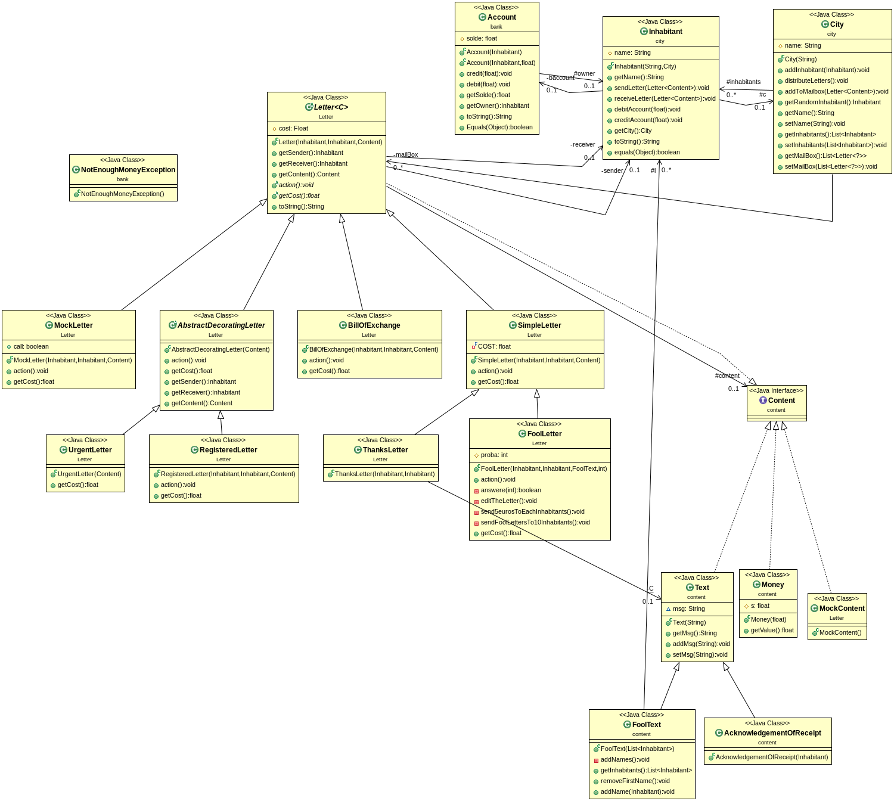

# Projet 3 : Letter

**Lina RADI, Assia TRARI**

### Le projet

L'objectif de ce projet est de simuler la distribution de courriers dans une ville pendant quelques jours.Les habitants déposent le courrier dans une boite au lettre, et le courrier est distribué le lendeman. Il y a plusieurs types de courrier différents avec des actions associées différentes.

### howto

**Récuperation du dépot**
*à la racine du projet*

	`$git pull`

**génération de la documentation**

	`$mvn javadoc:javadoc`

*Note* : la documentation sera consultable dans le dossier doc

**génération du projet**

	'$mvn package'

**execution (jar executable)**

	`$java -jar target/city.MainQ11-1.0-SNAPSHOT.jar`

**éléments de code**

Nous avons essayer d'utiliser le refractor, surtout pour la methode action de FoolLetter. Nous avons respecter les design pattern vu au td courrier. Nous avons choisi de d'implementer un accusé de reception comme étant un contenu, qui sera envoyé dans une lettre simple. Le type registeredLetter envoi cette lettre par l'intermediaire de action().

**état du projet**
Dans le pom.xml, nous avons mis pour la creation du jar le MainQ11, nous n'avons pas su comment faire pour faire deux jar executables.
A cause d'une mauvaise gestion du temps, nous n'avons pas complètement fini le tp, il manque surement des tests et un peu de documentations.
Nous avons fait un main pour chaque question 10 et 11.
Ayant des problemes avec maven, nous avons executé le MainQ11 en l'executant sur eclipse et ça fonctionne.Nous n'avons pas pu executé le Mainq10 car il nécessite en argument le nombre de jours et le nombre d'habitants 
Pour les observations, avec une simulation de 30 personnes et une probabilité de 15% de reponses, la chaine est sois trop courte, sois infinie.
Avec 10 habitants, nous avons obtenu une courte chaine où le plus riches possède 13 euros (un habitans possédant à la base 3euros).

### Diagrammes

