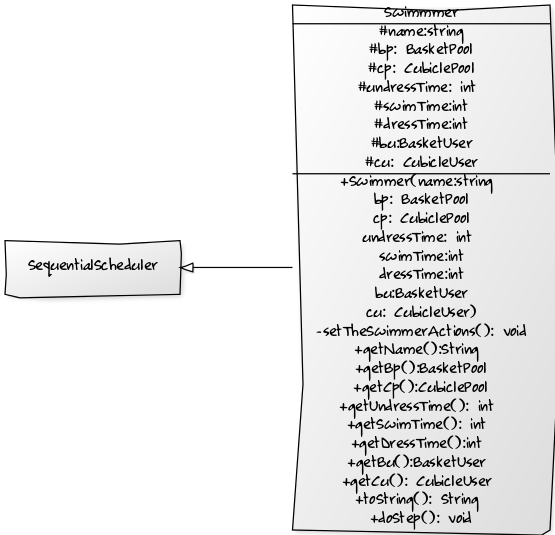
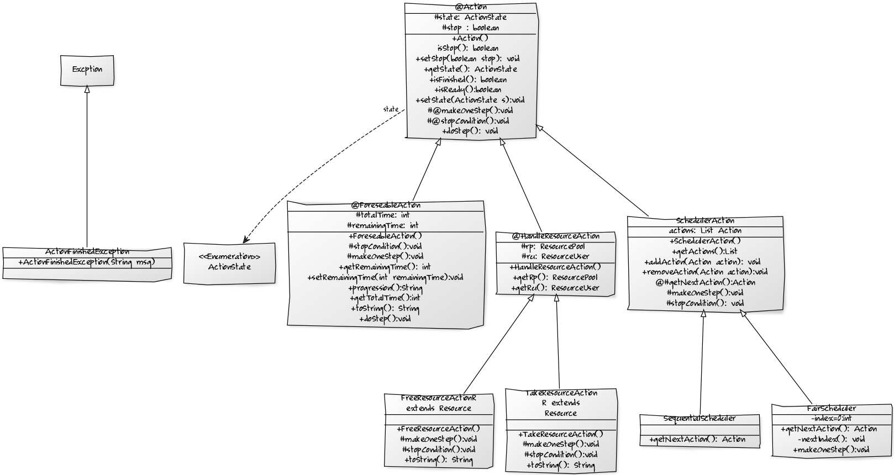
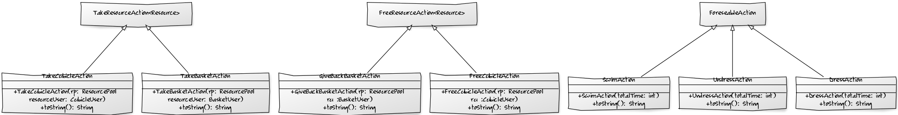
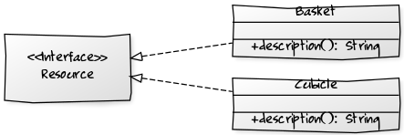
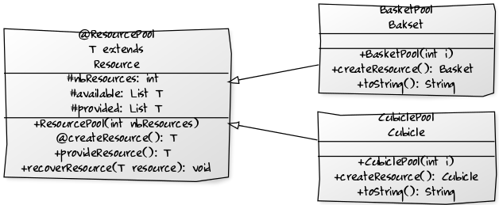
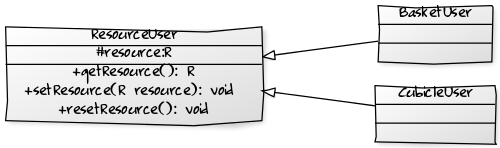

# Projet 2 : Piscine

**Lina RADI, Assia TRARI**

### Le projet

L'objectif de ce projet et de simuler l'utilisation de ressource partagée connue sous le nom du problème de la piscine.
Une piscine enregsitre des nageurs et leurs fournit des cabines et des paniers. Chaques nageurs, executes les actions prendre un panier (selon disponibilité), une cabine(selon disponibilité), se deshabiller(avec une durée qui lui est propre), rendre la cabine, nager(avec une durée qui lui est propre), prendre une cabine(selon disponibilité), se rhabiller(avec une durée qui lui est propre), rendre la cabine et rendre le panier. 
les action des nageurs se fond de manière sequentielle, mais l'evolution des nageur dans la piscine se fait de maniere parallèle.

### howto

**Récuperation du dépot**
*à la racine du projet*

	`$git pull`

**génération de la documentation**

	`$mvn javadoc:javadoc`

*Note* : la documentation sera consultable dans le dossier doc

**génération du projet**

	'$mvn package'

**execution (jar executable)**

	`$java -jar target/SwimmingPool-1.0-SNAPSHOT.jar`

**éléments de code**

Pour SchedulerAction, nous avons utiliser le design pattern template method pour makeOneStep() et une factory method pour getNextAction.
Dans Action, doStep() est une template methode.

Nous avons aussi utiliser une classe HandleResourceAction pour factoriser TakeResourceAction et FreeResourceAction. (Aussi pour factoriser les tests)

### Diagrammes

